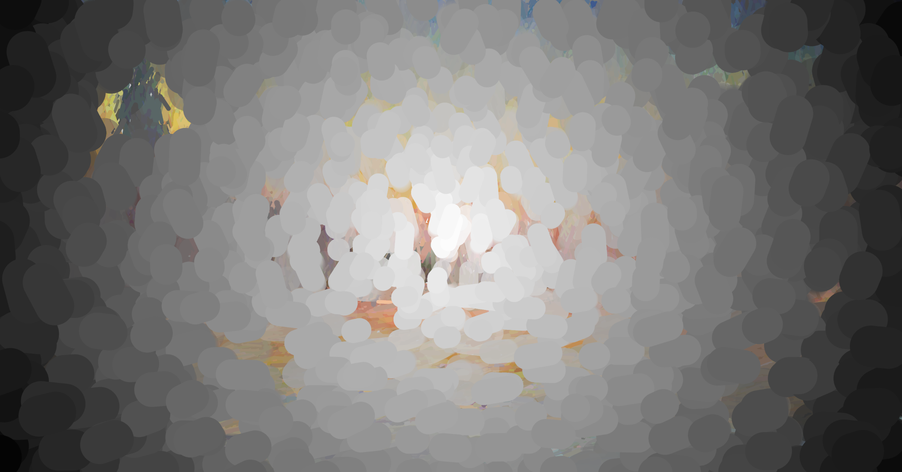
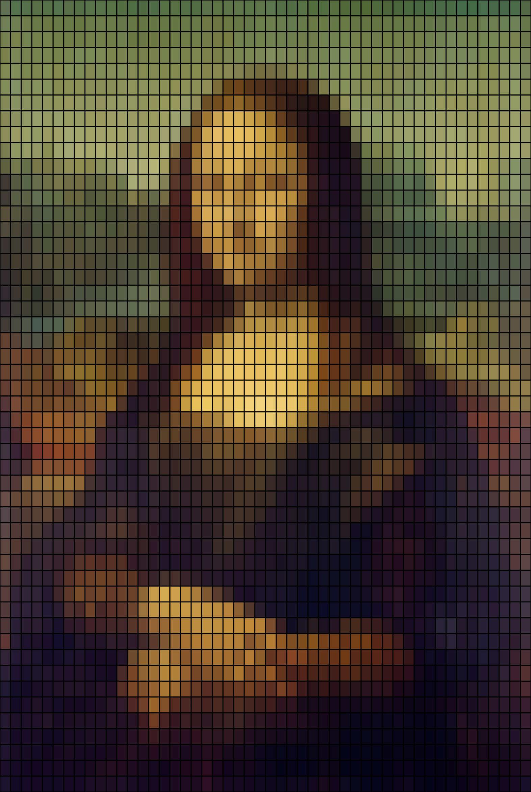

# Creative-coding-major-project
**Instructions**
- Slowly move the mouse on the screen, you can change the effect of brush strokes; hold and drag the mouse to change the line to change the overall line rendering effect; press the number "1" will change the color of the line, you can also drag the mouse; press the number "2" will generate a misty effect, press the number "0" to clear all the effects; press the space bar to present the original work.

**Details of animating**

- Individual code: interaction

- When the mouse is hovered over the screen, the original drawing will be changed, and the area where the mouse is hovered over will become a rotating effect centered on the mouse. Dragging the mouse at this point will thicken all the line segments, making the whole thing blurry. Pressing the number "1" will change the line segments to a random color that is continuously refreshed, and dragging the mouse at this time will have the same thickening effect. Pressing number "2" will cause a mist-like effect to appear on the canvas, and you can see through the mist to see the painting behind it by using the mouse to cover the area . Pressing the number 0 will clear the effect of "1","2". You can also interact with the keyboard by pressing the space bar to display the original drawing and again to return to the drawing screen.

These artworks provided inspiration for my design, and I used some of the similar functionality like mouse hovering and drag, key pressed and so on to animate the effect in my own code.

1. Global Variables:
Added some additional global variables such as mouseXCoord, mouseYCoord, circleRadius, showOriginal, and specialEffect. These additional global variables add more interactivity and visual effects to the code.
1. Line Class:
The update() method has been modified, adding a condition to check if the midpoint of the line is within the mouse circle's range. If it is, the midpoint of the line is rotated.
1. Draw Function:
A conditional statement showOriginal has been added to display the original artwork or apply effects based on user selection. Additionally, adding mouse position tracking within the function to draw a circle and changes the thickness of lines when the mouse is dragged.
1.  Interaction:
Adding some mouse event listener functions such as mouseMoved(), mouseDragged(), and keyPressed(), allowing users to interact with the canvas through mouse and keyboard inputs and dynamically change the effect status.